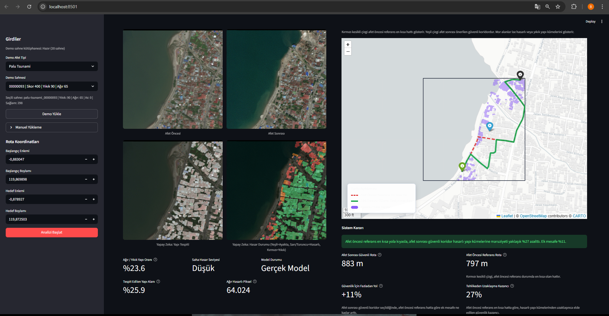
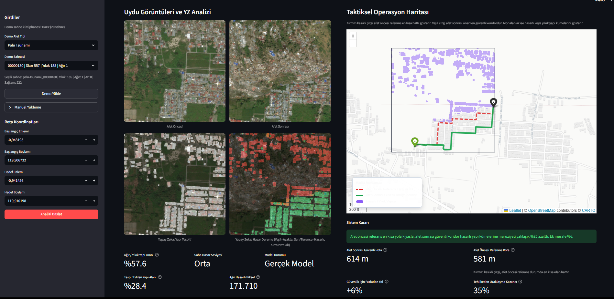
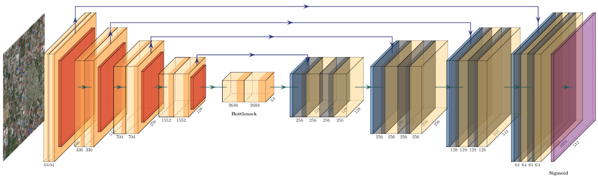
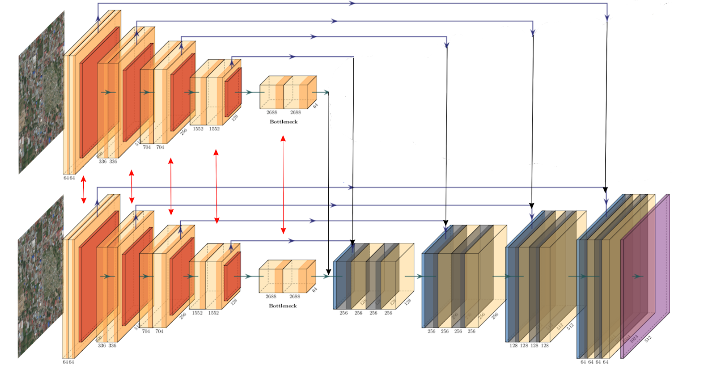

# Otonom Taktiksel Tahliye ve Kinetik Risk Haritalama Sistemi

## Projenin Tanımı

---

Bu proje, afet öncesi ve afet sonrası uydu görüntülerini yapay zeka ile karşılaştırarak hasarlı yapı kümelerini tespit eden ve bu bilgiyi gerçek yol ağı ile birleştirip kurtarma ekipleri için **güvenli tahliye koridoru** üreten bir karar destek sistemidir.

Afet anlarında en büyük sorun, sahadaki hasarın hızlı ve doğru şekilde okunamaması, ekiplerin hangi güzergahı kullanacağının net belirlenememesi ve operasyonun gecikmesidir. Çalışmamız, uydu verisini doğrudan operasyonel karara dönüştürerek bu problemi çözmeyi hedeflemektedir.

---


## Otonom Taktiksel Tahliye Sistemi Örnek Kullanım Videosu

<p align="center">
  <a href="assets/presentation/otonom_taktiksel_tahliye_ornek_kullanim.mp4">
    
  </a>
</p>

<p align="center">
  <a href="assets/presentation/otonom_taktiksel_tahliye_ornek_kullanim.mp4"><strong>▶ Örnek kullanım videosunu aç</strong></a>
</p>

---

<p align="center">
  
  
</p>

> **NOT:** Yukarıdaki ekran görüntüsü, tsunami afet senaryosuna ait örnek bir analiz çıktısıdır.

- **1 –** Uydu görüntülerindeki **yeşil binalar** zarar görmemiş yapıları, **kırmızı binalar** zarar gören yapıları temsil eder.
- **2 –** Taktiksel operasyon haritasında **yeşil nokta** başlangıç noktasını, **siyah nokta** bitiş noktasını gösterir.
- **3 –** **Kırmızı kesikli yol** afet olmadan önceki en kısa rotayı temsil eder. **Yeşil kalın yol** ise afet sonrası hesaplanan en güvenli ve en kısa tahliye koridorunu gösterir.
- **4 –** **Mavi nokta** AFAD veya benzeri ekiplerin operasyon merkezini kuracağı en uygun konumu önerir. **Mor bölgeler** yıkık yapıların taktiksel haritadaki iz düşümüdür; operasyon merkezinin enkaz alanına kurulmasını engeller.


## Veri Seti

Sistemin test edildiği açık veri kaynağı **xView2 (xBD)** setidir. Bu veri setinde aynı bölgeye ait:

- Afet öncesi yüksek çözünürlüklü RGB uydu görüntüsü
- Afet sonrası yüksek çözünürlüklü RGB uydu görüntüsü
- Bina poligonları ve hasar sınıf etiketleri

bulunmaktadır.

| Parametre | Değer |
|-----------|-------|
| Görüntü boyutu | 1024 × 1024 piksel |
| Kanal sayısı | 3 (RGB) |
| Uzamsal çözünürlük | ~0.3 metre |
| Sınıflar | background · no-damage · minor-damage · major-damage · destroyed |

---

## Proje İş Akışı

1. Afet öncesi ve afet sonrası uydu görüntüleri sisteme yüklenir.
2. Yapay zeka modeli binaları tespit eder ve hasar seviyelerini sınıflandırır.
   - `dpn_unet` → bina lokalizasyonu
   - `dpn_seamese_unet_shared` → hasar sınıflandırma
3. Hasarlı ve yıkık yapı katmanı coğrafi olarak harita üzerine oturtulur.
4. Bölgenin gerçek yol ağı **OpenStreetMap** verisi üzerinden çekilir.
5. Afet öncesi referans rota ve afet sonrası güvenli rota hesaplanır.
6. Uygun açık alanlar taranarak **operasyon üssü adayı** önerilir.
7. Tüm sonuçlar tek ekranda görselleştirilerek operatöre sunulur.

---

## Teknik Yapı

### Yapay Zeka Mimarisi

<p align="center">
  
  
</p>

Sistemin yapay zeka omurgasında **Siamese-UNet** tabanlı bir CNN yapısı kullanılmıştır. Bu model xView2 afet veri seti üzerinde eğitilmiş olup, afet öncesi ve afet sonrası uydu görüntüleri arasındaki değişimi öğrenir. Hem yapı tespiti hem de hasar seviyelendirmesi yapabilmektedir.

**İlk model — DPN92 encoder tabanlı U-Net lokalizasyon ağı:** Afet öncesi görüntü üzerinden çalışarak görüntü içindeki yapı ayak izlerini piksel seviyesinde çıkarır. Yani sistem önce *"nerede bina var?"* sorusunu çözer. DPN92 omurgası çok seviyeli uzamsal öznitelikler çıkarırken, U-Net decoder yapısı bu öznitelikleri yukarı örnekleyerek tam çözünürlükte bina maskesi üretir.

**İkinci model — Shared-weight Siamese U-Net hasar sınıflandırma ağı:** Afet öncesi ve afet sonrası görüntüleri iki ayrı giriş olarak alır; ancak iki kolda aynı encoder ağırlıkları paylaşılır. Böylece model iki zaman anını aynı temsil uzayında analiz ederek zamansal farkı öğrenir. Decoder tarafında birleştirilen özellikler piksel bazında hasar sınıfı üretir:

| Sınıf | Açıklama |
|-------|----------|
| 0 | Hasarsız |
| 1 | Az Hasarlı |
| 2 | Ağır Hasarlı |
| 3 | Yıkık |

Bu yaklaşımın teknik avantajı: sistem tek bir görüntüye bakarak statik sınıflandırma yapmak yerine, iki zamanlı veri üzerinden **değişimi** öğrenir. Böylece bina kaybı, çökme ve yapısal bozulma gibi afet etkileri daha güvenilir şekilde yakalanır.

### Eğitim Parametreleri

**Bina Lokalizasyonu (DPN92 U-Net):**

| Parametre | Değer |
|-----------|-------|
| Batch size | 8 |
| Epoch | 100 |
| Optimizer | FusedAdam |
| Learning rate | 1e-4 |
| Crop boyutu | 512 × 512 |

**Hasar Sınıflandırma (Siamese U-Net):**

| Parametre | Değer |
|-----------|-------|
| Batch size | 6 |
| Epoch | 60 |
| Optimizer | FusedAdam |
| Learning rate | 1e-4 |
| Crop boyutu | 512 × 512 |

**Augmentation teknikleri:** RandomSizedCrop · HorizontalFlip · VerticalFlip · Transpose · ImageCompression · RandomBrightnessContrast · RandomGamma

### Model Performans Metrikleri (Test Seti)

| Metrik | F1 Skor |
|--------|---------|
| **Overall** | **0.8076** |
| Localization | 0.8632 |
| Hasarsız | 0.9256 |
| Az Hasarlı | 0.6389 |
| Ağır Hasarlı | 0.7730 |
| Yıkık | 0.8590 |

---

## Coğrafi Hizalama

Yapay zeka katmanından elde edilen bina ve hasar maskeleri, bounding box meta verisi kullanılarak **WGS84 (EPSG:4326)** koordinat sistemine oturtulur. Böylece piksel uzayındaki hasar sonucu, gerçek dünya enlem-boylam koordinatlarına bağlanır. Bu katman daha sonra OpenStreetMap'ten çekilen yol ağı ile birleştirilir.

---

## Rota Planlama

Rota planlama tarafında sistem iki ayrı güzergah üretir:

1. **Afet öncesi referans en kısa rota** — haritadaki kırmızı kesikli çizgi
2. **Afet sonrası güvenli tahliye rotası** — haritadaki yeşil kalın çizgi

Güvenli rota yalnızca mesafeye göre değil, ağır hasarlı ve yıkık yapı kümelerinin çevresine yayılan risk alanı da hesaba katılarak çizilir. Yol segmentleri örneklenir, yakındaki hasar etkisi ölçülür ve **A\* algoritması** ile daha emniyetli koridor seçilir. Böylece sistem yalnızca görüntü yorumlayan bir yapay zeka olmaktan çıkar, doğrudan **taktiksel karar üreten bir otonomi katmanına** dönüşür.

### Ağır Hasarlı ve Yıkık Yapı Kümelerinin Çevresine Yayılan Risk Alanı Hesabı

A\* algoritmasının güvenli rotayı hesaplayabilmesi için, modelden çıkan maskelerin sürekli bir risk alanına dönüştürülmesi gerekmektedir. Eğer yıkık veya ağır hasarlı bir bina mevcutsa, kurtarma ekiplerinin o yönden gitmemesi sağlanmalıdır. Bu hesap aşağıdaki adımlarla yapılır:

**1 – Risk çekirdeği ve kinetik saçılma:** Modelden çıkan hasar maskesinde yalnızca **2 (ağır hasarlı)** ve **3 (yıkık)** sınıfları risk çekirdeği olarak alınır. Bu çekirdek üzerine morfolojik temizlik, genişletme (dilation) ve Gaussian bulanıklaştırma uygulanarak 0–255 aralığına normalize edilir. Böylece yıkılan bir bina yalnızca kendi pikselinde değil, çevresine de taşan bir etki alanı oluşturur — molozun sokağa taşma dinamiği simüle edilmiş olur.

**2 – Metrik yol örneklemesi:** Her yol segmenti yaklaşık **10 metrede bir** örneklenir. Örneğin 100 metrelik bir yol üzerinde 10'dan fazla kontrol noktası oluşturulur. Her kontrol noktası harita koordinatından raster piksel indeksine dönüştürülerek ısı haritasından **4 piksellik komşuluk yarıçapında** maksimum risk değeri okunur. Bu sayede yol tam enkaz üzerinde olmasa bile hemen yanındaki yıkıntıdan etkilenir.

**3 – Yüzdelik tabanlı risk kararı:** Bir yol üzerindeki tüm örneklerin ortalaması değil, **%85'lik yüzdelik değeri** alınır. Yolun güvenliği en temiz noktasına göre değil, en riskli bölgesine göre belirlenir.

**4 – Eksponansiyel maliyet formülü:**

$$safe\_weight = length\_m \cdot \exp(3.5 \cdot damage\_norm)$$

Burada `length_m` yolun metre cinsinden uzunluğu, `damage_norm = damage_score / 255.0` ise normalize edilmiş risk skorudur. Risk sıfırsa maliyet yalnızca mesafedir; risk arttıkça maliyet doğrusal değil **eksponansiyel** olarak büyür. Böylece A\* algoritması, kısa ama riskli bir koridoru otomatik olarak reddeder ve ekipleri enkazdan arındırılmış güvenli tahliye koridoruna yönlendirir.

---

## Arayüz

Tüm çıktılar **Streamlit** ve **Folium** tabanlı operatör arayüzünde birleştirilir. Kullanıcı aynı ekranda:

- Afet öncesi ve sonrası uydu görüntüsünü
- Bina tespit maskesini ve hasar sınıflarını
- Kinetik risk ısı haritasını
- Önerilen operasyon üssünü
- Referans (kırmızı) ve güvenli (yeşil) tahliye rotalarını
- Risk azalma oranı ve rota uzama metriklerini

tek bakışta görebilir. Sistem, CNN tabanlı algı modülü ile GIS tabanlı rota optimizasyonunu tek karar destek platformunda birleştirmiş olur.

---

## Kurulum ve Çalıştırma

```bash
python3 -m venv .venv
source .venv/bin/activate
pip install -r requirements.txt
streamlit run app.py
```

### CLI ile Çıkarım

```bash
python inference.py \
  --pre path/to/pre.png \
  --post path/to/post.png \
  --metadata path/to/metadata.json \
  --output-dir outputs/inference
```

### Testler

```bash
python -m unittest discover -s tests -v
```
